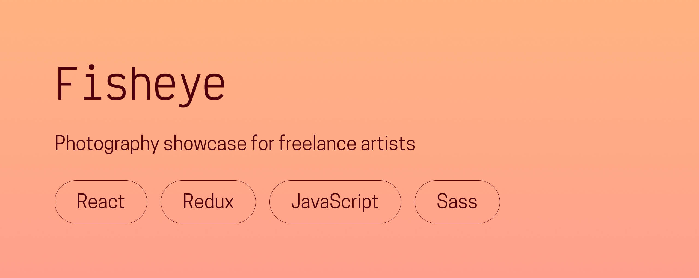

# 📸 Fisheye

**A modern React remake of a fictional photography showcase platform for freelance artists.**  
Created in 2023 as part of my front-end development studies.

---

## 🌟 Overview
Fisheye is a concept platform that allows freelance photographers to showcase their work and connect with potential clients.  

Each photographer has a dedicated profile page featuring their details, a contact form, and a dynamic gallery to display their photos and videos in full-screen mode. Users can browse through portfolios, like their favorite content, and sort media by popularity or date.

Originally built with **HTML, CSS, and JavaScript**, this project was **remade with React, Redux, and Sass** to explore scalable component structures, modular styling, and improved accessibility.

---

## 🖥️ Live demo
👉 [**Visit Fisheye**](https://fisheye.chloeadrian.dev/)  

You can also see its dedicated project page on my [**portfolio**](https://chloeadrian.dev/en/project/fisheye).

---

## ⚙️ Tech stack
- **React** for modular, dynamic interfaces  
- **Redux** for managing app-wide state (sorting, likes, and modal controls)  
- **Sass** for maintainable, structured styling  
- **HTML5 & modern CSS** for accessibility and layout foundations  

---

## 🧠 Key features
- View and browse photographers’ profiles and media  
- Full-screen lightbox gallery with keyboard navigation  
- Sort media by popularity, title, or date  
- Like and unlike photos or videos dynamically  
- Accessible and fully responsive layout  

---

## 🕊️ Reflection
This project was a major step in my React learning process, focusing on **state management, reusable components, and accessibility**.  
Transforming a static exercise into a dynamic, reactive application taught me how to design scalable interfaces while preserving the original UX intent.

---

Thanks for reading, and happy browsing!  
Chloé Adrian ✨